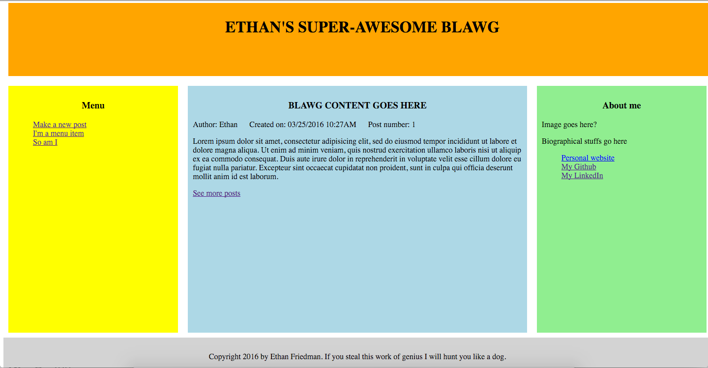
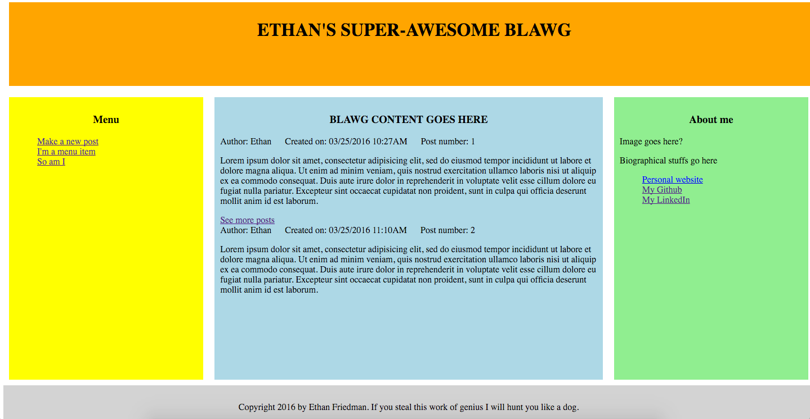
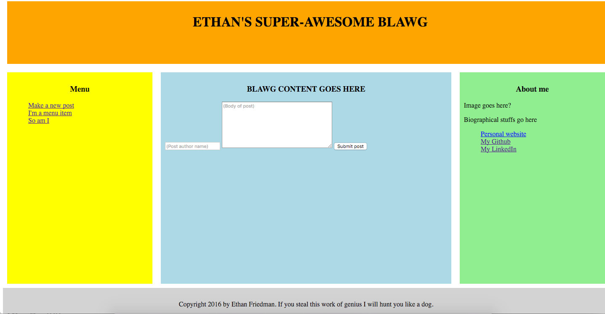
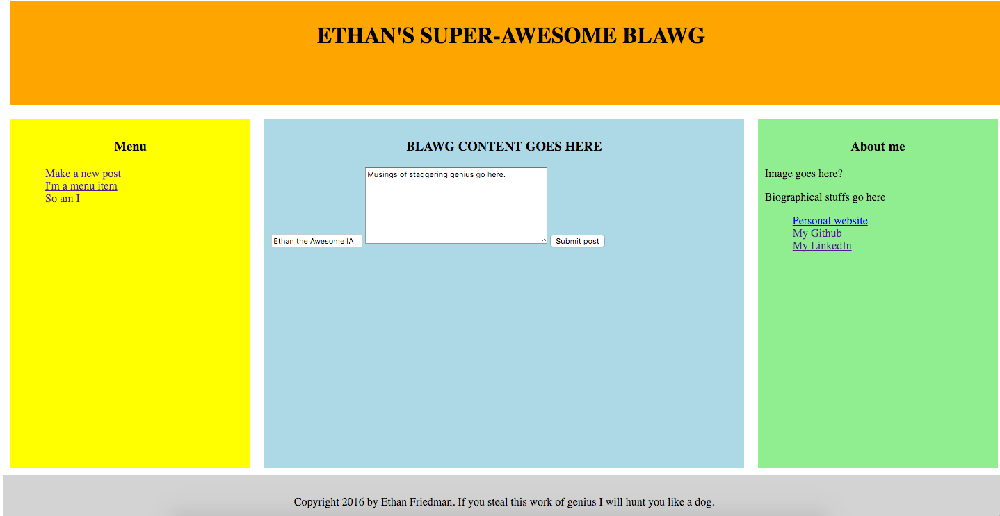

# End of the week!

YOU ARE NOW HALFWAY THROUGH THIS COURSE! 6 weeks in, 6 to go.

Stand up and cheer! Seriously, you're all still alive, you're all still here, CONGRATULATIONS!


## Now LET'S GET BACK TO WORK
## Let's build a Blawg!

Your developer wings have unfurled! Let's start to fly!

Make a directory structure exactly like Babblr. Here's the last time I'll write it out:

blawg/ (or whatever you want to call it) -- you app's 'root directory'. app.js here along w/ package.json and a .gitignore file

blawg/node_modules/ little aliens live here. Just kidding here's your node modules.

blawg/data/ JSON data files live here

blawg/public frontend lives here. index.html goes here

blawg/public/scripts/ your frontend JS goes here

blawg/public/stylesheets/ your CSS goes here

As usual, you'll want to `npm init` and then `npm install` necessary packages, etc.

You should build a simple, functioning blawg. Here's a mockup for you.



I used the so-called "Holy Grail" layout: you can copy or use a different general layout. But this is a good simple one:
* header across the top
* footer across the bottom
* navbar on the left
* bio on the right
* blog content in the middle

On page load, the most recent post should be visible in the center. If you click the "show more posts" link (remember to *prevent* the link's *default* behavior! ) you should get additional posts, e.g., something like



(This is a simple mockup. You can do better. For example, maybe display the next 3 or 5 posts, not just the next one. Also, ideally, the "show more posts" link would appear below the final post, not below the first post, after additional posts have loaded.)

If you click the "add a new post" link in the navbar, it should replace the content in the center section with the necessary fields to create a new post. This should look a lot like your Babblr from last night:



In addition to the features shown, each post should also have a "delete" button and an "edit" button (or use links instead of a button).
  * Clicking the "delete" button should, shockingly delete the post.
  * Clicking the "edit" button should bring up a form that looks a lot like the "add a new post" button EXCEPT that the "value" attribute of any user inputs is preset to the existing value of the post, if that makes sense. (If you use a textarea input for the content of the post, like I did, you'll need to set the textarea's innerText = to the post's content). Sort of like this:

  

Whew!

I would **really** like to see a search posts by author link in the navbar (it could even be a dropdown prepopulated by a list of the people who've posted to the blog -- this is a communal blog) that would display all posts by a given author.

This last point wraps up the frontend. So let's discuss the backend.

You'll need routes to handle
* Getting all posts
* Making a new post
* Deleting a post
* Editing a post

We're going to structure our backend data in a way that's more database-like and lets us do cool things (like pull all posts by a given author, if desired).

I want you to make TWO json files in your data/ directory: `authors.json` and `posts.json`.

We're going to start by just using posts.json, and then we'll modify it and loop in the authors.json file.

After you JSON.parse your posts.json file, it might look like this:
```js
{
  posts: [
            {
              post_id: 1,
              date_created: "03/25/2016 12:04PM",
              author: "Ethan",
              title: "Ethan I'm going to hate you after this weekend",
              content: "Lorem ipsum dolor sit amet, consectetur adipisicing elit, sed do eiusmod tempor incididunt ut labore et dolore magna aliqua. Ut enim ad minim veniam, quis nostrud exercitation ullamco laboris nisi ut aliquip ex ea commodo consequat. Duis aute irure dolor in reprehenderit in voluptate velit esse cillum dolore eu fugiat nulla pariatur. Excepteur sint occaecat cupidatat non proident, sunt in culpa qui officia deserunt mollit anim id est laborum."
            },
            {
              (etc.)
            },
            {
              (etc.)
            }
          ],
    postCount: 3
}
```

Date_created is something we haven't discussed yet: Whenever you create a new post object, before you add it into the parsed array of your posts.json data, make a new variable called `var postDate = new Date`.

Try console.log(postDate) -- it should have the date and time you made it. now when you're creating your new post object, you can give it a
`date_create: postDate` key:value pair.

This makes it handy to, say, display the most recent posts, or to, if you chose, display posts in a certain date range, etc. etc.

It also models how real-world databases generally work: each item in a database contains a timestamp with its creation date/time.

The other new field is the post_id field, which will be an integer. Each new post should have a unique ID. This is important. The IDs are assigned in order (1,2,3,4) but if the post with ID 3 is deleted, the next new post is assigned ID 5, not ID 3.

We do this by nesting our data one layer deeper. Instead of just an array of posts, our JSON file is an object with two properties: `posts`, which is an array of posts, and `postCount`, which is the ID of the highest-numbered post in our posts array.

Whever you make a new post, you're going to first increment `postCount`, and then create that new post's post_id and set it equal to `postCount`

WHEW. OK, now build out your app. this part should feel familiar from classwork yesterday and today, plus labs yesterday and today and last night's homework. Refer to last night's README file and the other pieces of code as needed. Here's a summary:

GET('/'): on the frontend, loading up the page should trigger an ajax call to make a GET request to '/'. On the backend, getting that request should cause the server to `fs.ReadFile` on posts.json and send that data to the client. Back on the front end, getting that response back, it should parse the data, store it in a (global) variable, and display the first post *only* in the main content section.

**FOR A FIRST STEP** just display *all* the posts on pageload. Make sure the posts are displayed newest first! Get all the other parts of the app working, then come back here and do the part in italics below:

*Once you have the rest of the app working, change the behavior of what happens on initial page load as follows: Clicking 'show more posts' should grab the next five posts (or all of them if there are fewer than five) and append them to the main content section. Use Handlebars if you're feeling adventurous! You'll need to keep track of which posts have been displayed BTW, so that the next time you click 'show more posts' it displays the next five and so on. So:

page load: newest post displayed.

first click on 'show more posts': displays the next 5 posts

second click: displays the 5 posts are that

and so on.*

Skipping the part above in italics for now, let's build out the other pieces of functionality.

Add a click listener on the 'create a new post' link. It should prevent the link's default behavior and instead toggle the display of a previously hidden div in the main content section that contains the input fields to create a new post.

Clicking the 'submit post' button in that form should act just like creating a new babbl did: it will grab the info the user entered and send a POST request to the server with the info. On the backend, receiving a POST to '/' will grab the data (you'll need the body-parser package as usual). Then it will read all the data from posts.json, parse the JSON, make a new post object (remember to add in post_id using the `postCount` incrementor (which also needs to be increased by 1!), add the new post to the data, and then write the file. It should then send the entire new array of posts to the client. On the frontend, when it receives the new array back (with the new post included), it should overwrite the global variable containing the posts data and display the newest post (the one just created) in the main container.

***BONUS*** *When making a new post, the server should confirm that the new post's post_ID is not the same as any existing post's ID in the data; if there is a duplicate, it should refuse to write the data and send back a `response.json({success: false})` or something like that.*

Deleting a post: each post should contain a link to delete it. You'll need to make a DELETE request to the server (after preventing the link's default behavior) to ('/:id'), with the post's ID as a param. On the backend, you'll need to grab it, obtain the ID, read the posts.json file, find the object with that ID, and splice it from the array.

Editing a post: this one may be hard. Clicking the 'edit post' link should bring up a previously hidden form that looks exactly like the 'new post' form. Except instead of making a POST request to '/' which is what a new post did, clicking on the button (which should read 'submit edits') should initiate a PUT request to '/:id', passing in the edited post's ID. On the backend, the server will need to grab the data from the request, then read all the posts from posts.json, find the one whose id matches the id of the edited post, and overwrite its content with the edits.

## IF YOU'VE MADE IT THIS FAR, YOU SHOULD BE PROUD!

If you've gotten this far, I'm really happy (Also you should have committed your code MULTIPLE times by now!). BUT we can still do better. So unless it's Sunday at 10pm, let's keep plugging away. **There is reading to do for Monday, so make sure you allot time for that before returning to this app to improve the backend!**

What we've got is nice, but our backend data structure is still a little crude. Let's make it a little more robust so it functions like a "real" database.

I would save all your functioning code (you should have working GET, POST, PUT, and DELETE routes, be able to view posts, make a post, edit a post, and delete a post). and create a whole new app in a new directory. run `npm init`, install the necessary modules, and copy over all your existing files. That way, your functioning code is in folder A, and your new code is a copy of the same app in folder B.

(We could also do a git branch here, but we haven't covered that yet, so just copy-and-paste for now.)

We are going to make our data structure better. Instead of one `posts.json` file, make two files in your data/ directory: `posts.json` and `authors.json`.

Authors.json, parsed as a JavaScript object, should look like this:
```js
{
  authors: [
              {
                name: "Ethan",
                auth_id: 1,
                posts: [1, 2, 5, 7, 8]

              },
              {
                name: "Liza",
                auth_id: 2,
                posts: [3, 6]
              },
              {
                name: "Syed",
                auth_id: 3,
                posts: [4]
              }
            ],
  authorCount: 3
}
```

This should be straightforward: what might be odd-looking is the "posts" field which is an array of numbers. Each of those numbers, you may have guessed, is the post_id of a post that this author made. So Syed wrote the post with post_id 4 in our posts database, Liza wrote 3 and 6, etc.

Posts.json should look a lot like before *EXCEPT* that instead of the `author` field being a string with the author's name, it will be an integer corresponding to that author's `auth_id`:

```js
{
  post_id: 1,
  date_created: "03/25/2016 12:04PM",
  author: 1,
  title: "Ethan I REALLY HATE YOU NOW SO SO SO VERY MUCH",
  content: "Lorem ipsum dolor sit amet, consectetur adipisicing elit, sed do eiusmod tempor incididunt ut labore et dolore magna aliqua. Ut enim ad minim veniam, quis nostrud exercitation ullamco laboris nisi ut aliquip ex ea commodo consequat. Duis aute irure dolor in reprehenderit in voluptate velit esse cillum dolore eu fugiat nulla pariatur. Excepteur sint occaecat cupidatat non proident, sunt in culpa qui officia deserunt mollit anim id est laborum."
}
```

Do you see how this is more powerful? Now it's easy to add all sorts of features to our app? Want to display just Liza's posts? Or all of Ethan's posts that were created between March 24 and March 26, 2016? You can think of ways to do this.

However, now we have to get our code to work right. It's going to be hard. For example, let's say you wanted to add a `search by author` dropdown to your navbar, that's dynamically populated with the author names. When you choose one and click `search`, it should show all of that author's post. You'll have to read and send over both author data and post data to make that work. For now, just tinker around!

And have a drink (except for Tyler).

## PART TWO: READING AND INSTALLATION

If you did the final part of the Blawg exercise above, you've built a very, very simplified version of mongoDB. mongoDB is a cool database we're going to use to hook up to our full-stack apps so we can stop faking it with json.

First, head over to https://docs.mongodb.org/v2.4/tutorial/install-mongodb-on-os-x/
and follow the instructions. If at any point the console tells you "operation not permitted", re-run the disallowed command, but prefix it with "sudo".

e.g., if you run `chown `id -u` /data/db` and you get back "operation not permitted", run `sudo chown `id -u` /data/db` and enter your password if necessary to execute the command.

Second, read up through page 14 of [The Little Book of MongoDB](http://openmymind.net/mongodb.pdf). We're going to get practice with all this in class don't worry! Just try to get a general handle on how the database is set up, and how to do CRUD operations: Create, Read, Update, and Destroy.
